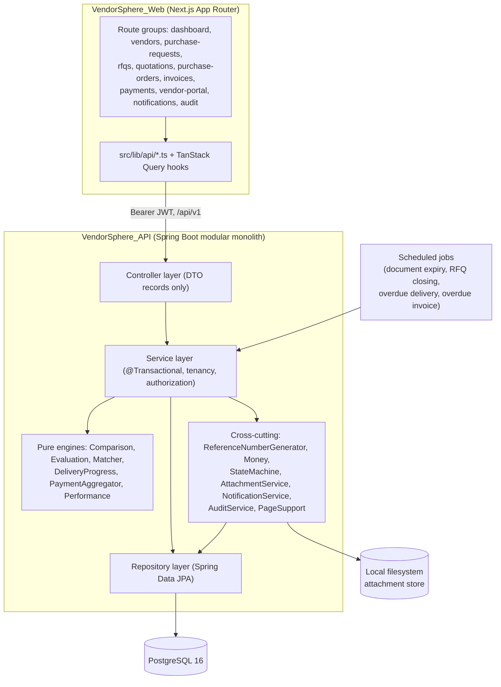
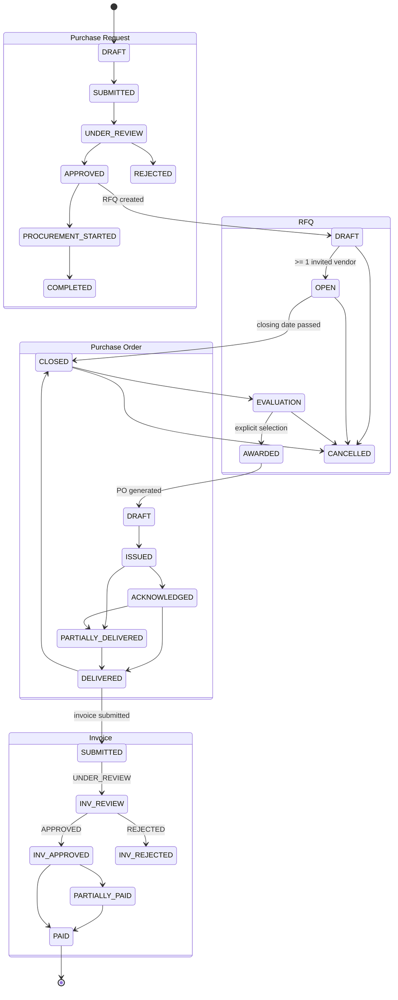
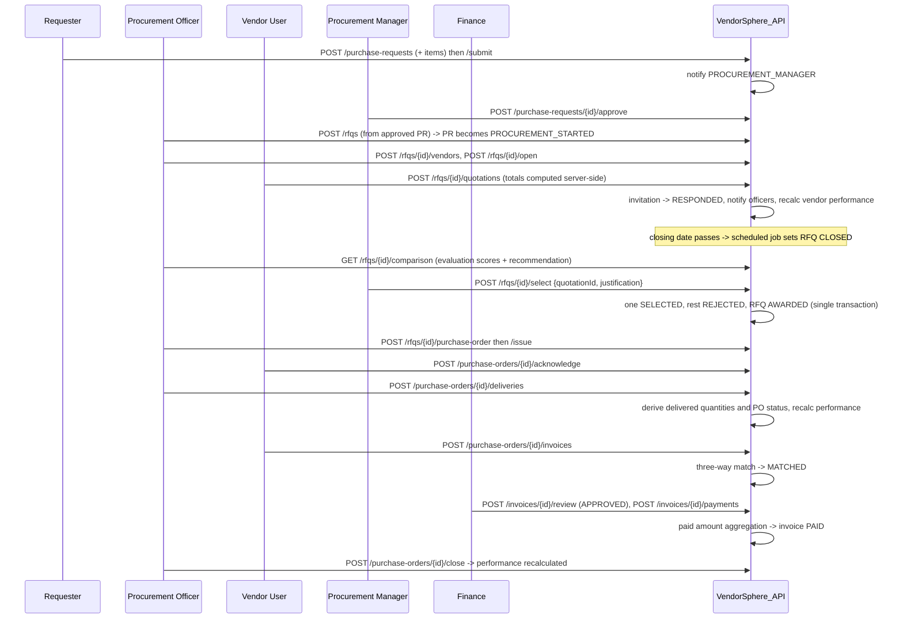
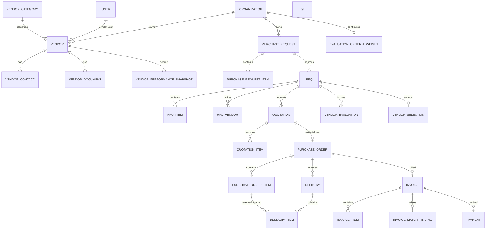

# Design Document

## Overview

This design covers the remaining scope of VendorSphere: the full procurement lifecycle from vendor onboarding to vendor performance scoring, plus the frontend that exposes it. Phases 1–2 (build tooling, Flyway, CI, JWT auth, RBAC, users, organizations, departments, common layer) are already in place and this design extends them rather than replacing them.

The work adds nine new backend modules (`vendor`, `procurement`, `rfq`, `quotation`, `purchaseorder`, `delivery`, `invoice`, `payment`, `analytics`) plus three cross-cutting modules (`notification`, `audit`, and attachment support in `common`), one Flyway migration (`V2`), and the Next.js screens for every stage.

### Design goals

| Goal | Approach |
| --- | --- |
| Money and quantity correctness | A single `Money` utility owns scale (2) and rounding (HALF_UP) for money and scale (3) for quantities. No arithmetic outside it. |
| Client cannot influence figures | Every total, tax, line total, score, cumulative quantity and paid amount is derived server-side from stored primitives. Request DTOs simply do not carry computed fields; where a legacy payload does, the value is discarded. |
| Deterministic, testable business rules | Comparison, evaluation, three-way matching, delivery progress, payment aggregation and performance scoring are pure functions over record inputs. They contain no repository or security calls, so they can be unit- and property-tested directly. |
| No accidental awards | The evaluation engine only marks a `recommended` flag. Award requires an explicit `POST .../select` carrying a justification. Nothing else mutates RFQ status to `AWARDED`. |
| Tenant isolation | Every repository read is keyed on `organization_id`. Cross-tenant identifiers surface as 404, never 403, so identifiers are not enumerable. |
| Vendor confidentiality | A vendor-scoped access guard resolves the caller's linked vendor once per request; quotation reads are filtered by that vendor, and prices are projected out of officer-facing responses until the RFQ closes. |
| Atomic critical paths | Award, PO generation, delivery posting, invoice submission with matching, and payment posting are single `@Transactional` units. Concurrent edits are caught by `@Version` and mapped to 409. |
| Append-only audit | The audit repository exposes save and query only. The audit controller declares only `GET`, so Spring MVC answers `PUT`/`PATCH`/`DELETE` with 405. Audit writes join the caller's transaction, so a failed audit write rolls the business change back. |

### Key decisions and rationale

**Reference numbers use a dedicated sequence table, not `MAX(...) + 1`.** A `reference_sequences` row keyed on `(organization_id, prefix, year)` is incremented with a single `UPDATE ... RETURNING next_value`, which takes a row lock and therefore hands distinct values to concurrent transactions (Requirement 1.6). `MAX(number) + 1` over the business table would let two concurrent transactions read the same maximum. The allocation runs on the caller's connection, so it commits and rolls back with the record that carries the number (Requirement 1.5).

**State machines are declarative transition tables, not `switch` chains.** A generic `StateMachine<S extends Enum<S>>` holds `Map<S, Set<S>>` and answers `permits(from, to)` / `assertTransition(from, to)`. Five instances (`VendorStatus`, `PurchaseRequestStatus`, `RfqStatus`, `PurchaseOrderStatus`, `InvoiceStatus`) then encode Requirements 3.1, 8.1, 11.1, 19.1 and 24.1 as data, which makes the "accepted exactly when listed" property directly testable.

**Pure engines sit beside thin services.** `ComparisonEngine`, `EvaluationEngine`, `ThreeWayMatcher`, `DeliveryProgressCalculator`, `PaymentAggregator` and `PerformanceCalculator` take immutable input records and return immutable outputs. The surrounding `@Service` loads entities, calls the engine, and persists results. This keeps the parts with real arithmetic free of Spring and JPA.

**Attachments are polymorphic and stored on disk.** One `attachments` table with `owner_type` / `owner_id` serves vendor documents, PR attachments, RFQ documents, quotation documents, delivery proofs and invoice documents, so upload validation, size limits and access checks live in one place. Files land under a configured base directory using a random UUID key; the original filename is metadata only, never part of the path (Requirement 33.5).

**Notifications are deduplicated at write time.** `notifications` gains an `event_type` column and a unique index on `(user_id, event_type, entity_type, entity_id)`. `NotificationService.createOnce(...)` inserts and swallows the constraint violation, giving the idempotence Requirement 28.9 asks for without a read-then-write race.

**Performance recalculation is synchronous.** Requirement 26.9 fires recalculation on delivery recording, quotation submission, quotation selection and PO transitions to `DELIVERED`/`CLOSED`. The metric queries are aggregates over one vendor's rows, so running them in the same transaction is acceptable at MVP scale and avoids introducing a message broker (explicitly out of scope).

---

## Architecture

### Module and layer structure



### Package layout

Each business module follows the existing convention already used by `organization` and `user`: `controller`, `dto`, `entity`, `repository`, `service`.

| Package | Contents |
| --- | --- |
| `common.util` | `Money`, `StateMachine`, `ReferenceNumberGenerator`, `PageSupport`, `SortWhitelist` |
| `common.attachment` | `Attachment` entity, `AttachmentRepository`, `AttachmentService`, `AttachmentStorage`, `AttachmentController` |
| `common.config` | existing `SecurityConfig`, `OpenApiConfig`; new `SchedulingConfig`, `AttachmentProperties` |
| `vendor` | vendors, vendor contacts, vendor categories, vendor documents, status lifecycle, `VendorAccessGuard` |
| `procurement` | purchase requests and items, submission and review |
| `rfq` | RFQs, RFQ items, vendor invitations, publication and closing |
| `quotation` | quotations, quotation items, total computation, `ComparisonEngine`, `EvaluationEngine`, `SelectionService`, criteria weights |
| `purchaseorder` | purchase orders, items, generation from award, lifecycle |
| `delivery` | deliveries, delivery items, progress derivation, overdue flagging |
| `invoice` | invoices, invoice items, `ThreeWayMatcher`, match findings, review and override |
| `payment` | payments, payment aggregation, outstanding payables |
| `analytics` | `PerformanceEngine`, performance snapshots, dashboard and report services |
| `notification` | notifications, dedupe, read state |
| `audit` | audit log entries, append-only service and read API |

### Lifecycle state flow



### Signature scenario sequence



### Cross-cutting concerns

**Multi-tenancy.** Services resolve `SecurityUtils.getCurrentOrganizationId()` and pass it into every finder: `findByIdAndOrganizationId(...)`. For child records reachable only through a parent (quotation items, delivery items, payments) the parent is loaded tenant-scoped first and the child is validated to belong to it. A miss throws `new BusinessException("<Entity> not found", HttpStatus.NOT_FOUND)` so the exact messages the requirements pin (`Vendor not found`, `Quotation not found`, `Purchase order not found`, `Notification not found`) are produced verbatim. `ResourceNotFoundException` stays in use where the message is not pinned.

**Authorization.** Endpoint-level `@PreAuthorize` on controller methods encodes the role grants of Requirement 30.3–30.8, matching the existing `OrganizationController` style. Vendor-scoped rules that depend on data (own vendor, own quotation, own PO) cannot be expressed in a role annotation, so they are enforced in the service through `VendorAccessGuard`:

```java
public interface VendorAccessGuard {
    /** Vendor id linked to the current user, or empty when the caller is an internal user. */
    Optional<UUID> currentVendorId();
    /** Throws 404 when the caller is a vendor user and the record belongs to another vendor. */
    void assertVendorVisible(UUID recordVendorId, String notFoundMessage);
}
```

**Transactions and concurrency.** Award, PO generation, delivery recording, invoice submission with matching, and payment recording carry `@Transactional` on the service method (Requirement 32.1). Audit writes and notification writes participate in that transaction. `@Version` is added to `Vendor`, `PurchaseRequest`, `Rfq`, `Quotation`, `PurchaseOrder` and `Invoice`; `GlobalExceptionHandler` gains a handler for `ObjectOptimisticLockingFailureException` returning 409 `Record was modified by another user, reload and retry`.

**Auditing.** `AuditService.record(AuditEntry)` serializes previous and new state to JSON with Jackson and captures IP and user agent from the current `HttpServletRequest`. It is called synchronously at the end of each state-changing service method listed in Requirement 29.2. Because it shares the transaction, a persistence failure propagates and rolls the business change back, and `GlobalExceptionHandler`'s generic handler returns 500 (Requirement 29.10).

**Scheduling.** `SchedulingConfig` enables `@EnableScheduling`. Four jobs, all expressed in UTC:

| Job | Schedule | Effect |
| --- | --- | --- |
| `VendorDocumentExpiryJob` | `0 30 0 * * *` | Notifies admins and officers about documents expiring in exactly 30, 7 or 1 day |
| `RfqClosingJob` | `0 */5 * * * *` | Closes `OPEN` RFQs past their closing date; nudges non-responding invited vendors 24–25 hours out |
| `OverdueDeliveryJob` | `0 0 1 * * *` | Sets the delivery overdue flag and notifies officers on the transition to true |
| `OverdueInvoiceJob` | `0 15 1 * * *` | Moves unpaid invoices past their due date to `OVERDUE` |

**Numeric handling.** `spring.jackson.serialization.write-bigdecimal-as-plain=true` is enabled and all monetary DTO values are already scaled to 2 by `Money`, so serialization emits exactly two decimal places (Requirement 32.7) without a custom serializer.

**Pagination.** `PageSupport.pageable(page, size, sort, direction, SortWhitelist)` applies page 0 / size 20 defaults, clamps size to 100, and rejects unknown sort fields with 400 listing the allowed fields. `PageSupport.map(Page<E>, Function<E,D>)` produces the existing `PageResponse` record.

---

## Components and Interfaces

### Common utilities

```java
public final class Money {
    public static final int MONEY_SCALE = 2;
    public static final int QUANTITY_SCALE = 3;
    public static final RoundingMode ROUNDING = RoundingMode.HALF_UP;

    public static BigDecimal money(BigDecimal value);          // scale 2, HALF_UP, null -> 0.00
    public static BigDecimal quantity(BigDecimal value);       // scale 3, HALF_UP, null -> 0.000
    public static BigDecimal sumMoney(Collection<BigDecimal> values);
    public static BigDecimal sumQuantity(Collection<BigDecimal> values);
    public static BigDecimal multiply(BigDecimal a, BigDecimal b);   // money scale
    public static BigDecimal percentOf(BigDecimal base, BigDecimal ratePercent);
    public static BigDecimal ratio(BigDecimal numerator, BigDecimal denominator, BigDecimal whenZero);
    public static BigDecimal clampScore(BigDecimal value);     // clamp to [0.00, 100.00]
}
```

```java
public final class StateMachine<S extends Enum<S>> {
    public static <S extends Enum<S>> StateMachine<S> of(Map<S, Set<S>> transitions);
    public boolean permits(S from, S to);
    public void assertTransition(S from, S to);   // BusinessException(409, "Cannot transition from X to Y")
    public Set<S> targetsFrom(S from);
}
```

```java
public interface ReferenceNumberGenerator {
    /** Allocates the next number for the org, prefix and current year inside the caller's transaction. */
    String allocate(UUID organizationId, ReferencePrefix prefix);
}

public enum ReferencePrefix { VEN, PR, RFQ, PO, DEL }
```

`AttachmentService` centralizes upload rules:

```java
public interface AttachmentService {
    AttachmentResponse upload(AttachmentOwnerType ownerType, UUID ownerId, MultipartFile file);
    List<AttachmentResponse> list(AttachmentOwnerType ownerType, UUID ownerId);
    AttachmentDownload download(UUID attachmentId);   // access checked against owning record
    void delete(UUID attachmentId);
}

public enum AttachmentOwnerType {
    VENDOR_DOCUMENT, PURCHASE_REQUEST, RFQ, QUOTATION, DELIVERY_PROOF, INVOICE
}
```

### Vendor module

| Component | Responsibility |
| --- | --- |
| `VendorService` | Registration with generated `VEN` code and `PROSPECTIVE` status, profile update, tenant-scoped reads with category name, performance score and expiring-document count, paged search |
| `VendorStatusService` | Status transitions through `VendorStatusTransitions`, reason enforcement for `SUSPENDED`/`BLACKLISTED`/`INACTIVE`, audit entry with previous status, new status and reason |
| `VendorContactService` | Contact CRUD, single-primary enforcement, ordering (primary first, then name ascending) |
| `VendorCategoryService` | Category CRUD, per-organization name uniqueness, delete guard counting referencing vendors |
| `VendorDocumentService` | Document upload via `AttachmentService`, document type allowlist, expiry state derivation |
| `VendorAccessGuardImpl` | Resolves `vendors.user_id` for the current principal, caches per request |

```java
public record VendorSearchCriteria(
        String companyName, UUID categoryId, VendorStatus status, BigDecimal minRating) {}

public enum DocumentExpiryState { VALID, EXPIRING_SOON, EXPIRED }

public final class DocumentExpiryEvaluator {   // pure
    public static DocumentExpiryState evaluate(LocalDate expiryDate, LocalDate today);
}
```

### Purchase request module (`procurement`)

`PurchaseRequestService` owns authoring (title, department, justification, required date, priority defaulting to `MEDIUM`, estimated budget), item management while `DRAFT`, attachment upload while `DRAFT`, submission (requires ≥ 1 item, notifies managers, locks items), and review (approve/reject with reviewer, timestamp and notes; rejection requires a reason). Reads for the requester include reviewer name, review timestamp, review notes and derived RFQ identifiers.

### RFQ module

`RfqService` creates an RFQ from a `APPROVED`/`PROCUREMENT_STARTED` purchase request, copying each PR item into an RFQ item with `purchase_request_item_id` retained, and transitions the first-time source PR to `PROCUREMENT_STARTED`. It validates `closingDate > openingDate`, allows item and header edits while `DRAFT`, and drives publication, closing and cancellation through `RfqStatusTransitions`. `RfqVendorService` handles invitations: all-or-nothing validation that every vendor is `ACTIVE` and not already invited, `INVITED → VIEWED` on first vendor read, `RESPONDED` on quotation submission, `AWARDED` on selection. Vendor-facing listing returns only RFQs the linked vendor is invited to whose status is `OPEN`, `CLOSED`, `EVALUATION` or `AWARDED`.

### Quotation module

```java
/** Pure: computes every monetary figure of a quotation from vendor-supplied primitives. */
public final class QuotationCalculator {
    public static QuotationTotals compute(List<QuotationItemInput> items, BigDecimal shippingAmount);
}

public record QuotationItemInput(
        UUID rfqItemId, String itemName,
        BigDecimal quantity, BigDecimal unitPrice,
        BigDecimal taxRate, BigDecimal discountAmount) {}

public record QuotationItemTotals(
        UUID rfqItemId, BigDecimal taxAmount, BigDecimal lineTotal) {}

public record QuotationTotals(
        List<QuotationItemTotals> items,
        BigDecimal subtotal, BigDecimal taxAmount,
        BigDecimal discountAmount, BigDecimal shippingAmount, BigDecimal totalAmount) {}
```

`QuotationService` enforces the submission window (`RFQ OPEN` and before the closing date), completeness (one item per RFQ item, error lists missing item names), field ranges, validity date ≥ RFQ closing date, revision with recomputation, attachments, and confidentiality. Submission sets `SUBMITTED`, records the instant, moves the invitation to `RESPONDED`, notifies officers and triggers performance recalculation. Request DTOs deliberately omit computed fields; a `QuotationRequest` carrying them is rejected at the DTO boundary because the record has no such components, satisfying Requirement 13.6 by construction.

`QuotationVisibilityPolicy` decides projection: vendor users see only their own quotation; internal users see a submitted count but no prices while the RFQ is `OPEN`, and full figures from `CLOSED` onward.

```java
public final class ComparisonEngine {   // pure
    public static ComparisonTable build(RfqSummary rfq, List<QuotationView> quotations,
                                        Map<UUID, EvaluationResult> scores);
}

public final class EvaluationEngine {   // pure
    public static List<EvaluationResult> score(List<QuotationScoreInput> quotations,
                                               CriteriaWeights weights);
}

public record QuotationScoreInput(
        UUID quotationId, UUID vendorId, BigDecimal totalAmount,
        Integer deliveryPeriodDays, Integer warrantyMonths,
        BigDecimal vendorPerformanceScore, boolean vendorHasCompletedOrder) {}

public record EvaluationResult(
        UUID quotationId, BigDecimal priceScore, BigDecimal deliveryScore,
        BigDecimal warrantyScore, BigDecimal performanceScore,
        BigDecimal totalScore, boolean recommended) {}

public record CriteriaWeights(
        BigDecimal price, BigDecimal delivery, BigDecimal performance, BigDecimal warranty) {
    public static final CriteriaWeights DEFAULT =
            new CriteriaWeights(bd("0.40"), bd("0.25"), bd("0.25"), bd("0.10"));
    public void validateSum();   // BusinessException(400, "Criteria weights must sum to 1.00")
}
```

`SelectionService.select(rfqId, quotationId, justification)` runs in one transaction: the target quotation becomes `SELECTED`, every other `SUBMITTED`/`UNDER_REVIEW` quotation becomes `REJECTED`, the RFQ becomes `AWARDED`, the winning invitation becomes `AWARDED`, a `vendor_selections` row is written, all invited vendor users are notified of the outcome, and the audit entry is recorded.

### Purchase order module

`PurchaseOrderService.generateFromRfq(rfqId)` copies the selected quotation's items (name, quantity, unit price, tax rate, tax amount, line total, delivered quantity 0) and totals into a `DRAFT` PO with a generated `PO` number, delivery address from the RFQ delivery location, payment terms from the quotation, and expected delivery date = generation date + quotation delivery period. It rejects RFQs without a selection and RFQs that already have a PO (naming the existing number). `PurchaseOrderStatusService` drives issue (notifies vendor users), vendor acknowledgement, cancellation guards (reason required; blocked once any delivery is recorded), closing (only from `DELIVERED`, triggers performance recalculation), and vendor-scoped listing that hides `DRAFT`.

### Delivery module

```java
public final class DeliveryProgressCalculator {   // pure
    public static ItemProgress itemProgress(BigDecimal orderedQuantity, List<DeliveryItemView> receipts);
    public static PurchaseOrderStatus deriveStatus(PurchaseOrderStatus current, List<ItemProgress> progress);
}

public record ItemProgress(
        UUID purchaseOrderItemId, BigDecimal ordered, BigDecimal received,
        BigDecimal damaged, BigDecimal rejected, BigDecimal outstanding) {}
```

`DeliveryService.record(...)` validates in order: every referenced PO item belongs to the PO, received quantity > 0, damaged and rejected each ≤ received, and cumulative received ≤ ordered (409 naming item, ordered and cumulative). It then writes the delivery and items, recomputes each affected PO item's `delivered_quantity` as the sum of receipts, derives PO status, clears the overdue flag, re-evaluates matching for any `SUBMITTED`/`UNDER_REVIEW` invoice on that PO, notifies officers and finance, and recalculates vendor performance — all in one transaction.

### Invoice module

```java
public final class ThreeWayMatcher {   // pure and deterministic
    public static MatchOutcome match(MatchInput input);
}

public record MatchInput(
        String purchaseOrderNumber,
        boolean purchaseOrderHasDelivery,
        List<MatchLine> lines,
        List<PriorMatchedInvoice> priorMatchedInvoices) {}

public record MatchLine(
        UUID purchaseOrderItemId, String itemName,
        BigDecimal orderedQuantity, BigDecimal receivedQuantity,
        BigDecimal invoicedQuantity,
        BigDecimal purchaseOrderUnitPrice, BigDecimal invoicedUnitPrice) {}

public record MatchOutcome(MatchStatus status, List<MatchFinding> findings) {}

/** Declaration order is the precedence order of Requirement 23.7. */
public enum MatchFindingType { DUPLICATE_INVOICE, MISSING_DELIVERY, QUANTITY_MISMATCH, PRICE_MISMATCH }

public enum MatchResolutionState { UNRESOLVED, OVERRIDDEN }
```

`InvoiceService` handles submission (invoice number uniqueness per vendor per organization, due date ≥ invoice date, PO status gate, server-side line total and total computation), review through `InvoiceStatusTransitions` with the unresolved-finding gate, match finding override with justification, overdue flagging, and vendor-scoped listing. `PRICE_MISMATCH` uses a tolerance of 0.01 on the absolute difference.

### Payment module

```java
public final class PaymentAggregator {   // pure
    public static BigDecimal paidAmount(List<PaymentView> payments);   // sum of PAID payments, money scale
    public static InvoiceStatus deriveInvoiceStatus(
            InvoiceStatus current, BigDecimal paidAmount, BigDecimal totalAmount);
}
```

`PaymentService.record(...)` validates amount > 0, invoice status in `APPROVED`/`PARTIALLY_PAID`/`OVERDUE`, and cumulative paid ≤ invoice total (409 naming both figures), then writes the payment with status `PAID`, sets the invoice paid amount from the aggregator, derives the invoice status, notifies vendor users and audits — one transaction. `outstandingPayables()` returns the organization total plus a per-vendor breakdown over invoices in `APPROVED`/`PARTIALLY_PAID`/`OVERDUE`.

### Analytics module

```java
public final class PerformanceCalculator {   // pure
    public static PerformanceMetrics compute(PerformanceInputs inputs);
    public static BigDecimal vendorRating(BigDecimal performanceScore);   // score / 20, scale 2
}

public record PerformanceInputs(
        long onTimeDeliveries, long totalDeliveries,
        BigDecimal damagedAndRejectedQuantity, BigDecimal receivedQuantity,
        List<BigDecimal> quotationPriceRatios,
        long quotationsBeforeClosing, long invitations,
        long deliveredOrClosedOrders, long activeOrders) {}

public record PerformanceMetrics(
        BigDecimal delivery, BigDecimal quality, BigDecimal pricing,
        BigDecimal responsiveness, BigDecimal fulfilment, BigDecimal overall) {}
```

`PerformanceEngine` gathers the aggregates with repository projections, calls the calculator, upserts the month's `vendor_performance_snapshots` row, and writes the derived rating back onto the vendor. `AnalyticsService` serves the dashboard summary and the monthly-spend, spend-by-department, spend-by-vendor, category distribution, vendor performance and average cycle time reports through read-only aggregate queries.

### Notification and audit modules

```java
public interface NotificationService {
    void createOnce(UUID recipientId, NotificationEvent event, String entityType, UUID entityId,
                    String title, String message);
    void createForRole(UUID organizationId, String roleName, NotificationEvent event, ...);
    void createForVendorUsers(UUID vendorId, NotificationEvent event, ...);
    PageResponse<NotificationResponse> list(boolean unreadOnly, Pageable pageable);
    void markRead(UUID id);
    void markAllRead();
    long unreadCount();
}

public interface AuditService {
    void record(AuditAction action, String entityType, UUID entityId, Object previous, Object current);
    PageResponse<AuditLogResponse> search(AuditSearchCriteria criteria, Pageable pageable);
}
```

`NotificationEvent` enumerates the sixteen events of Requirement 28.2; `AuditAction` enumerates the twenty-two actions of Requirement 29.2.

### API surface

All paths sit under `/api/v1`, every response is wrapped in `ApiResponse`, and every list endpoint returns `PageResponse` and accepts `page`, `size`, `sort`, `direction`.

| Area | Endpoints |
| --- | --- |
| Vendors | `GET/POST /vendors`, `GET/PUT /vendors/{id}`, `PATCH /vendors/{id}/status`, `GET/POST /vendors/{id}/contacts`, `PUT/DELETE /vendors/{id}/contacts/{contactId}`, `GET/POST /vendors/{id}/documents`, `GET /vendors/{id}/performance`, `GET/POST /vendor-categories`, `PUT/DELETE /vendor-categories/{id}` |
| Purchase requests | `GET/POST /purchase-requests`, `GET/PUT /purchase-requests/{id}`, `POST/PUT/DELETE /purchase-requests/{id}/items[/{itemId}]`, `POST /purchase-requests/{id}/attachments`, `POST /purchase-requests/{id}/submit`, `POST /purchase-requests/{id}/approve`, `POST /purchase-requests/{id}/reject` |
| RFQs | `GET/POST /rfqs`, `GET/PUT /rfqs/{id}`, `POST/PUT/DELETE /rfqs/{id}/items[/{itemId}]`, `GET/POST /rfqs/{id}/vendors`, `POST /rfqs/{id}/documents`, `POST /rfqs/{id}/open`, `POST /rfqs/{id}/close`, `POST /rfqs/{id}/cancel` |
| Quotations | `GET/POST /rfqs/{id}/quotations`, `GET/PUT /quotations/{id}`, `POST /quotations/{id}/documents`, `GET /rfqs/{id}/comparison`, `POST /rfqs/{id}/evaluate`, `POST /quotations/{id}/comments`, `POST /rfqs/{id}/select`, `GET/PUT /evaluation-criteria-weights` |
| Purchase orders | `POST /rfqs/{id}/purchase-order`, `GET /purchase-orders`, `GET/PUT /purchase-orders/{id}`, `POST /purchase-orders/{id}/issue`, `POST /purchase-orders/{id}/acknowledge`, `POST /purchase-orders/{id}/close`, `POST /purchase-orders/{id}/cancel` |
| Deliveries | `GET/POST /purchase-orders/{id}/deliveries`, `GET /purchase-orders/{id}/delivery-progress`, `GET /deliveries`, `GET /deliveries/{id}` |
| Invoices | `GET /invoices`, `POST /purchase-orders/{id}/invoices`, `GET /invoices/{id}`, `GET /invoices/{id}/match`, `POST /invoices/{id}/match-findings/{findingId}/override`, `POST /invoices/{id}/review` |
| Payments | `GET/POST /invoices/{id}/payments`, `GET /payments`, `GET /payments/outstanding` |
| Analytics | `GET /analytics/dashboard`, `/analytics/spend/monthly`, `/analytics/spend/by-department`, `/analytics/spend/by-vendor`, `/analytics/categories`, `/analytics/vendor-performance`, `/analytics/cycle-time` |
| Notifications | `GET /notifications`, `GET /notifications/unread-count`, `PATCH /notifications/{id}/read`, `PATCH /notifications/read-all` |
| Audit | `GET /audit-logs` (ADMIN only; no write verbs declared, so other methods yield 405) |
| Attachments | `GET /attachments/{id}` |

### Frontend structure

```
frontend/src/
├── app/
│   ├── (app)/                      # authenticated shell: sidebar, header, notification bell
│   │   ├── dashboard/page.tsx
│   │   ├── vendors/page.tsx  vendors/[id]/page.tsx
│   │   ├── purchase-requests/page.tsx  purchase-requests/[id]/page.tsx
│   │   ├── rfqs/page.tsx  rfqs/[id]/page.tsx  rfqs/[id]/comparison/page.tsx
│   │   ├── purchase-orders/page.tsx  purchase-orders/[id]/page.tsx
│   │   ├── invoices/page.tsx  invoices/[id]/page.tsx
│   │   ├── payments/page.tsx
│   │   ├── notifications/page.tsx
│   │   └── audit-logs/page.tsx
│   └── (vendor)/vendor-portal/     # invitations, quotation form, POs, acknowledgement, invoices
├── components/
│   ├── ui/                         # shadcn/ui primitives
│   ├── role-guard.tsx              # renders access-denied message when roles do not match
│   ├── comparison-table.tsx        # one column per quotation, recommended marker
│   ├── selection-confirm-dialog.tsx# justification input, blocks submit while empty
│   ├── delivery-progress.tsx       # per-item ordered / received / outstanding
│   └── match-findings.tsx          # match status and finding list with override control
└── lib/
    ├── api.ts                      # existing apiClient (unchanged)
    ├── api/{vendors,purchaseRequests,rfqs,quotations,purchaseOrders,deliveries,invoices,payments,analytics,notifications,audit}.ts
    └── hooks/                      # TanStack Query hooks wrapping the api modules
```

New frontend dependencies: `shadcn/ui` primitives (Radix based), plus `vitest`, `@vitejs/plugin-react`, `jsdom`, `@testing-library/react`, `@testing-library/jest-dom` and `fast-check` as dev dependencies. Money values arrive as pre-formatted two-decimal strings/numbers and are rendered through a shared `formatMoney` helper rather than recomputed. Every form input is bound to a visible `<label>` and every icon-only control carries an accessible name.

---

## Data Models

### Entities and their tables

All entities extend the existing `BaseEntity` (UUID id, `created_at`, `updated_at`) except where the V1 table has no `updated_at`; those (`VendorContact`, `VendorDocument`, item tables, `Delivery`, `DeliveryItem`, `Payment`, `Notification`, `AuditLog`, `VendorEvaluation`, `VendorSelection`, `VendorPerformanceSnapshot`) use a `CreatedOnlyEntity` mapped superclass with id and `created_at` so JPA validation against the existing schema succeeds.



### Enumerations

Stored as `VARCHAR` with `@Enumerated(EnumType.STRING)`, matching the existing `CHECK` constraints.

| Enum | Values |
| --- | --- |
| `VendorStatus` | `PROSPECTIVE, ACTIVE, SUSPENDED, BLACKLISTED, INACTIVE` |
| `VendorDocumentType` | `GST_CERTIFICATE, REGISTRATION_CERTIFICATE, TAX_DOCUMENT, COMPLIANCE_CERTIFICATE, BANK_DETAILS, AGREEMENT` |
| `PurchaseRequestStatus` | `DRAFT, SUBMITTED, UNDER_REVIEW, APPROVED, REJECTED, PROCUREMENT_STARTED, COMPLETED` |
| `Priority` | `LOW, MEDIUM, HIGH, URGENT` |
| `RfqStatus` | `DRAFT, OPEN, CLOSED, EVALUATION, AWARDED, CANCELLED` |
| `RfqVendorStatus` | `INVITED, VIEWED, RESPONDED, DECLINED, AWARDED` |
| `QuotationStatus` | `DRAFT, SUBMITTED, UNDER_REVIEW, SELECTED, REJECTED, WITHDRAWN` |
| `PurchaseOrderStatus` | `DRAFT, ISSUED, ACKNOWLEDGED, PARTIALLY_DELIVERED, DELIVERED, CLOSED, CANCELLED` |
| `InvoiceStatus` | `SUBMITTED, UNDER_REVIEW, APPROVED, REJECTED, PARTIALLY_PAID, PAID, OVERDUE` |
| `MatchStatus` | `PENDING, MATCHED, QUANTITY_MISMATCH, PRICE_MISMATCH, MISSING_DELIVERY, DUPLICATE_INVOICE` |
| `MatchFindingType` | `DUPLICATE_INVOICE, MISSING_DELIVERY, QUANTITY_MISMATCH, PRICE_MISMATCH` (declaration order = precedence) |
| `MatchResolutionState` | `UNRESOLVED, OVERRIDDEN` |
| `PaymentStatus` | `PENDING, PARTIALLY_PAID, PAID, FAILED` |
| `DocumentExpiryState` | `VALID, EXPIRING_SOON, EXPIRED` |
| `AttachmentOwnerType` | `VENDOR_DOCUMENT, PURCHASE_REQUEST, RFQ, QUOTATION, DELIVERY_PROOF, INVOICE` |
| `NotificationEvent` | sixteen values covering Requirement 28.2 |
| `AuditAction` | twenty-two values covering Requirement 29.2 |

### Column types

| Concept | Type | Java |
| --- | --- | --- |
| Money | `DECIMAL(15,2)` | `BigDecimal`, scale 2, HALF_UP |
| Quantity | `DECIMAL(12,3)` | `BigDecimal`, scale 3, HALF_UP |
| Score, rate | `DECIMAL(5,2)` | `BigDecimal`, scale 2, range 0.00–100.00 |
| Weight | `DECIMAL(3,2)` | `BigDecimal`, scale 2, four values summing to 1.00 |
| Rating | `DECIMAL(3,2)` | `BigDecimal`, score / 20 |
| Timestamps | `TIMESTAMPTZ` | `Instant` |
| Dates | `DATE` | `LocalDate` |

### V2 migration

`V1__init_schema.sql` stays untouched. `V2__procurement_lifecycle.sql` adds:

```sql
-- Reference number sequences (Requirement 1)
CREATE TABLE reference_sequences (
    id              UUID PRIMARY KEY DEFAULT gen_random_uuid(),
    organization_id UUID NOT NULL REFERENCES organizations(id),
    prefix          VARCHAR(10) NOT NULL,
    year            INT NOT NULL,
    next_value      INT NOT NULL DEFAULT 0,
    UNIQUE (organization_id, prefix, year)
);

-- Organization-level evaluation criteria weights (Requirement 16)
CREATE TABLE evaluation_criteria_weights (
    id                  UUID PRIMARY KEY DEFAULT gen_random_uuid(),
    organization_id     UUID NOT NULL UNIQUE REFERENCES organizations(id),
    price_weight        DECIMAL(3,2) NOT NULL,
    delivery_weight     DECIMAL(3,2) NOT NULL,
    performance_weight  DECIMAL(3,2) NOT NULL,
    warranty_weight     DECIMAL(3,2) NOT NULL,
    updated_by          UUID REFERENCES users(id),
    created_at          TIMESTAMPTZ NOT NULL DEFAULT NOW(),
    updated_at          TIMESTAMPTZ NOT NULL DEFAULT NOW()
);

-- Three-way match findings (Requirements 23, 24)
CREATE TABLE invoice_match_findings (
    id                      UUID PRIMARY KEY DEFAULT gen_random_uuid(),
    invoice_id              UUID NOT NULL REFERENCES invoices(id) ON DELETE CASCADE,
    purchase_order_item_id  UUID REFERENCES purchase_order_items(id),
    finding_type            VARCHAR(30) NOT NULL,
    item_name               VARCHAR(255),
    expected_value          VARCHAR(255),
    actual_value            VARCHAR(255),
    detail                  TEXT,
    resolution_state        VARCHAR(20) NOT NULL DEFAULT 'UNRESOLVED',
    overridden_by           UUID REFERENCES users(id),
    overridden_at           TIMESTAMPTZ,
    override_justification  TEXT,
    created_at              TIMESTAMPTZ NOT NULL DEFAULT NOW(),
    CONSTRAINT chk_finding_type CHECK (finding_type IN (
        'DUPLICATE_INVOICE','MISSING_DELIVERY','QUANTITY_MISMATCH','PRICE_MISMATCH')),
    CONSTRAINT chk_finding_resolution CHECK (resolution_state IN ('UNRESOLVED','OVERRIDDEN'))
);

-- Polymorphic attachments (Requirement 33)
CREATE TABLE attachments (
    id                UUID PRIMARY KEY DEFAULT gen_random_uuid(),
    organization_id   UUID NOT NULL REFERENCES organizations(id),
    owner_type        VARCHAR(40) NOT NULL,
    owner_id          UUID NOT NULL,
    original_filename VARCHAR(255) NOT NULL,
    content_type      VARCHAR(150) NOT NULL,
    byte_size         BIGINT NOT NULL,
    storage_reference VARCHAR(255) NOT NULL UNIQUE,
    uploaded_by       UUID NOT NULL REFERENCES users(id),
    created_at        TIMESTAMPTZ NOT NULL DEFAULT NOW()
);

-- Optimistic locking (Requirement 32.3)
ALTER TABLE vendors            ADD COLUMN version BIGINT NOT NULL DEFAULT 0;
ALTER TABLE purchase_requests  ADD COLUMN version BIGINT NOT NULL DEFAULT 0;
ALTER TABLE rfqs               ADD COLUMN version BIGINT NOT NULL DEFAULT 0;
ALTER TABLE quotations         ADD COLUMN version BIGINT NOT NULL DEFAULT 0;
ALTER TABLE purchase_orders    ADD COLUMN version BIGINT NOT NULL DEFAULT 0;
ALTER TABLE invoices           ADD COLUMN version BIGINT NOT NULL DEFAULT 0;

-- Additional business columns
ALTER TABLE vendors         ADD COLUMN status_change_reason TEXT;
ALTER TABLE rfqs            ADD COLUMN cancellation_reason TEXT;
ALTER TABLE quotations      ADD COLUMN warranty_months INT;
ALTER TABLE purchase_orders ADD COLUMN acknowledged_at TIMESTAMPTZ,
                            ADD COLUMN delivery_overdue BOOLEAN NOT NULL DEFAULT FALSE,
                            ADD COLUMN cancellation_reason TEXT,
                            ADD COLUMN closed_at TIMESTAMPTZ;
ALTER TABLE invoices        ADD COLUMN review_comments TEXT;
ALTER TABLE notifications   ADD COLUMN event_type VARCHAR(60);

-- Notification idempotence (Requirement 28.9)
CREATE UNIQUE INDEX uq_notifications_event
    ON notifications(user_id, event_type, entity_type, entity_id)
    WHERE event_type IS NOT NULL AND entity_id IS NOT NULL;

-- List and filter indexes (Requirement 31.6)
CREATE INDEX idx_vendors_category        ON vendors(category_id);
CREATE INDEX idx_vendors_user            ON vendors(user_id);
CREATE INDEX idx_vendor_documents_expiry ON vendor_documents(expiry_date);
CREATE INDEX idx_pr_department           ON purchase_requests(department_id);
CREATE INDEX idx_pr_created              ON purchase_requests(created_at);
CREATE INDEX idx_rfqs_pr                 ON rfqs(purchase_request_id);
CREATE INDEX idx_rfq_vendors_vendor      ON rfq_vendors(vendor_id, status);
CREATE INDEX idx_quotations_status       ON quotations(status);
CREATE INDEX idx_po_expected_delivery    ON purchase_orders(expected_delivery);
CREATE INDEX idx_po_rfq                  ON purchase_orders(rfq_id);
CREATE INDEX idx_deliveries_po           ON deliveries(purchase_order_id, delivery_date);
CREATE INDEX idx_delivery_items_po_item  ON delivery_items(purchase_order_item_id);
CREATE INDEX idx_invoices_vendor         ON invoices(vendor_id);
CREATE INDEX idx_invoices_due            ON invoices(due_date);
CREATE INDEX idx_invoice_items_po_item   ON invoice_items(purchase_order_item_id);
CREATE INDEX idx_payments_invoice        ON payments(invoice_id, status);
CREATE INDEX idx_attachments_owner       ON attachments(owner_type, owner_id);
CREATE INDEX idx_perf_snapshots_vendor   ON vendor_performance_snapshots(vendor_id, period_start);
CREATE INDEX idx_audit_logs_actor        ON audit_logs(actor_id);
```

### DTO conventions

Request and response types are Java records under each module's `dto` package. Entities never cross a controller boundary. Request records carry only writable primitives; computed fields exist on response records only. Response records expose a static `from(entity)` factory, matching the existing `DepartmentResponse` / `UserResponse` style. Representative shapes:

```java
public record VendorRequest(
        @NotBlank String companyName, String contactPerson,
        @NotBlank @Email String email, String phone, String address,
        String taxIdentifier, UUID categoryId) {}

public record VendorResponse(
        UUID id, String vendorCode, String companyName, String contactPerson, String email,
        String phone, String address, String taxIdentifier, VendorStatus status,
        BigDecimal rating, UUID categoryId, String categoryName,
        BigDecimal performanceScore, long expiringDocumentCount,
        Instant registeredAt, Instant createdAt) {}

public record QuotationItemRequest(
        @NotNull UUID rfqItemId,
        @NotNull @DecimalMin("0.001") BigDecimal quantity,
        @NotNull @DecimalMin("0.00") BigDecimal unitPrice,
        @NotNull @DecimalMin("0.00") @DecimalMax("100.00") BigDecimal taxRate,
        @DecimalMin("0.00") BigDecimal discountAmount) {}

public record QuotationRequest(
        @NotEmpty List<QuotationItemRequest> items,
        @DecimalMin("0.00") BigDecimal shippingAmount,
        @Positive Integer deliveryPeriodDays, String paymentTerms,
        String warranty, @PositiveOrZero Integer warrantyMonths,
        @NotNull LocalDate validityDate, String notes) {}

public record ComparisonRowResponse(
        UUID quotationId, UUID vendorId, String vendorCompanyName,
        BigDecimal vendorPerformanceScore, BigDecimal totalAmount, BigDecimal subtotal,
        BigDecimal taxAmount, BigDecimal discountAmount, BigDecimal shippingAmount,
        Integer deliveryPeriodDays, Integer warrantyMonths, String paymentTerms,
        LocalDate validityDate, BigDecimal priceScore, BigDecimal deliveryScore,
        BigDecimal warrantyScore, BigDecimal performanceScore, BigDecimal totalScore,
        boolean recommended, List<ComparisonItemResponse> items) {}
```

---

## Correctness Properties

The pure components listed under "Pure engines sit beside thin services" take immutable record inputs and return immutable outputs, so their rules hold for every input rather than for chosen examples. Those rules are stated below as universal properties and are checked with [jqwik](https://jqwik.net) on the backend (added as a test-scoped dependency) and `fast-check` on the frontend. Unit tests still cover pinned messages, HTTP statuses and worked examples; the properties cover the arithmetic and the classification logic.

Conventions used by every property below: money comparisons use `compareTo` at scale 2, quantity comparisons use `compareTo` at scale 3, and generators produce values inside the column ranges of the data model (money ≤ `DECIMAL(15,2)`, quantity ≤ `DECIMAL(12,3)`, rates and scores in 0.00–100.00).

### Property 1: Money and quantity normalization

For every `BigDecimal` input, `Money.money(v)` returns a value with scale exactly 2 and `Money.quantity(v)` returns a value with scale exactly 3, both rounded HALF_UP, and `null` maps to `0.00` / `0.000`. For every collection, `sumMoney` equals the HALF_UP scale-2 sum of its normalized elements and is invariant under permutation of the collection. `clampScore(v)` always returns a value in `[0.00, 100.00]`, and is the identity on values already in range.

**Validates: Requirements 32.5, 32.6**

### Property 2: State machines accept exactly the listed transitions

For each of the five machines (`VendorStatus`, `PurchaseRequestStatus`, `RfqStatus`, `PurchaseOrderStatus`, `InvoiceStatus`) and for every ordered pair of states `(from, to)` drawn from the enum, `permits(from, to)` is true if and only if the pair appears in the transition table of the corresponding requirement clause, and `assertTransition(from, to)` throws a `BusinessException` carrying HTTP 409 and a message naming both states exactly when `permits` is false.

**Validates: Requirements 3.1, 3.2, 8.1, 8.2, 11.1, 11.2, 19.1, 19.2, 24.1, 24.2**

### Property 3: Reference number format and sequence monotonicity

For every organization, prefix and year, and for every sequence value `n ≥ 1` returned by the sequence table, the formatted reference matches `^(VEN|PR|RFQ|PO|DEL)-\d{4}-\d{3,}$`, its prefix segment equals the requested prefix, its year segment equals the allocation year, and its numeric segment parses back to `n` with at least three digits. For every strictly increasing sequence of allocations within one `(organization, prefix, year)` key, the produced references are pairwise distinct and their numeric segments are strictly increasing, starting at `001`.

**Validates: Requirements 1.1, 1.2, 1.3, 1.4**

### Property 4: Quotation totals are internally consistent and idempotent

For every list of `QuotationItemInput` and every non-negative shipping amount, `QuotationCalculator.compute` returns totals where each item tax amount equals `quantity × unitPrice × taxRate / 100` at scale 2, each item line total equals `quantity × unitPrice + itemTax − itemDiscount` at scale 2, `subtotal` equals the scale-2 sum of `quantity × unitPrice`, `taxAmount` equals the sum of item tax amounts, `discountAmount` equals the sum of item discount amounts, and `totalAmount` equals `subtotal + taxAmount − discountAmount + shippingAmount`. Recomputing from the same inputs yields an equal result, and the returned item list has one entry per input item in input order.

**Validates: Requirements 13.1, 13.2, 13.3, 13.4, 13.5**

### Property 5: Evaluation scores are bounded and exactly one quotation is recommended

For every non-empty list of `QuotationScoreInput` and every `CriteriaWeights` summing to 1.00, `EvaluationEngine.score` returns one result per input; every component score and every total score lies in `[0.00, 100.00]`; the quotation with the lowest total amount receives a price score of 100.00; a quotation with an absent or zero delivery period receives delivery score 0.00 and one with an absent or zero warranty duration receives warranty score 0.00; an input with `vendorHasCompletedOrder = false` receives performance score 50.00; and exactly one result carries `recommended = true`, that result having the maximum total score with ties broken by the lowest total amount.

**Validates: Requirements 16.1, 16.2, 16.3, 16.5, 16.6, 16.7, 16.8, 16.12**

### Property 6: Comparison rows are complete and ordered

For every RFQ summary, every list of quotation views and the matching score map, `ComparisonEngine.build` returns exactly one row per quotation view, each row carries one per-item entry per RFQ item, and the row sequence is non-increasing by total score with ties ordered by non-decreasing quotation total amount. An empty quotation list yields an empty row collection and a populated RFQ summary.

**Validates: Requirements 15.1, 15.3, 15.5, 15.6**

### Property 7: Match status follows finding precedence

For every `MatchInput`, `ThreeWayMatcher.match` returns `MATCHED` if and only if the findings list is empty; otherwise the returned status corresponds to the highest-precedence finding present under the order DUPLICATE_INVOICE, MISSING_DELIVERY, QUANTITY_MISMATCH, PRICE_MISMATCH. Matching the same input twice returns equal outcomes, and the findings list contains no duplicate `(type, purchaseOrderItemId)` pair.

**Validates: Requirements 23.6, 23.7**

### Property 8: Match findings are raised exactly when the comparison fails

For every `MatchInput`, the outcome contains a QUANTITY_MISMATCH finding for a line if and only if that line's invoiced quantity is greater than its received quantity; a PRICE_MISMATCH finding for a line if and only if the absolute difference between invoiced and purchase order unit price is greater than 0.01; a MISSING_DELIVERY finding if and only if `purchaseOrderHasDelivery` is false; and a DUPLICATE_INVOICE finding if and only if some prior matched invoice has line quantities and unit prices equal to those of the input.

**Validates: Requirements 23.2, 23.3, 23.4, 23.5**

### Property 9: Delivery progress conserves quantities

For every ordered quantity and every list of receipts, `DeliveryProgressCalculator.itemProgress` returns `received` equal to the scale-3 sum of receipt received quantities, `damaged` and `rejected` equal to the corresponding scale-3 sums, and `outstanding` equal to `ordered − received`. Where the receipts satisfy the service-level validation (each received quantity positive, cumulative received at most ordered), `outstanding` is greater than or equal to zero and `received` is non-decreasing as receipts are appended.

**Validates: Requirements 21.1, 20.9**

### Property 10: Purchase order status derivation is total and consistent

For every current status and every non-empty list of `ItemProgress`, `DeliveryProgressCalculator.deriveStatus` returns DELIVERED if and only if every item has `received ≥ ordered`; it returns PARTIALLY_DELIVERED if and only if at least one item has `0 < received < ordered` and not every item is fully received; and it returns the current status unchanged when no item has any received quantity. The returned status is always a member of `PurchaseOrderStatus` and never regresses from DELIVERED or CLOSED to PARTIALLY_DELIVERED.

**Validates: Requirements 21.2, 21.3**

### Property 11: Payment aggregation and invoice status derivation

For every list of `PaymentView`, `PaymentAggregator.paidAmount` equals the scale-2 sum of amounts whose status is PAID, ignores every other status, and is invariant under permutation. For every current status, paid amount and total amount, `deriveInvoiceStatus` returns PAID if and only if `paidAmount.compareTo(totalAmount) == 0`, PARTIALLY_PAID if and only if `0 < paidAmount < totalAmount`, and the current status unchanged when `paidAmount` is zero.

**Validates: Requirements 25.5, 25.6, 25.7**

### Property 12: Performance metrics are bounded, defaulted and averaged

For every `PerformanceInputs`, `PerformanceCalculator.compute` returns five metrics and an overall score all lying in `[0.00, 100.00]` at scale 2; every metric whose denominator input is zero equals exactly 50.00; the pricing metric never exceeds 100.00 however large the supplied ratios; and the overall score equals the scale-2 arithmetic mean of the five metrics.

**Validates: Requirements 26.6, 26.7, 26.8**

### Property 13: Vendor rating derives from the performance score

For every performance score in `[0.00, 100.00]`, `PerformanceCalculator.vendorRating` returns `score / 20` at scale 2 HALF_UP, the result lies in `[0.00, 5.00]`, and the mapping is monotonic: a greater score never yields a smaller rating.

**Validates: Requirements 26.11**

### Property 14: Document expiry classification is total and exclusive

For every expiry date (including absent) and every evaluation date, `DocumentExpiryEvaluator.evaluate` returns exactly one `DocumentExpiryState`: EXPIRED if and only if the expiry date is before the evaluation date, EXPIRING_SOON if and only if the expiry date falls in the inclusive window `[today, today + 30 days]`, and VALID otherwise or when the expiry date is absent.

**Validates: Requirements 5.4**

### Property 15: Pagination parameters are defaulted and clamped

For every combination of requested page, size, sort field and direction, `PageSupport.pageable` returns a `Pageable` whose page number is the requested page or 0 when absent or negative, whose page size is the requested size or 20 when absent, clamped into `[1, 100]`, and whose sort contains only fields present in the supplied whitelist; a sort field outside the whitelist always raises a `BusinessException` with HTTP 400 whose message lists the whitelisted fields.

**Validates: Requirements 31.3, 31.4, 31.5**

### Property 16: Criteria weights are accepted exactly when they sum to one

For every quadruple of weights, `CriteriaWeights.validateSum` completes without exception if and only if the scale-2 sum of the four values equals 1.00, and otherwise raises a `BusinessException` with HTTP 400 and the message `Criteria weights must sum to 1.00`. `CriteriaWeights.DEFAULT` satisfies the sum condition.

**Validates: Requirements 16.9, 16.11**

### Property 17: Comparison table rendering matches the quotation data

For every list of comparison rows rendered by `comparison-table.tsx`, the table renders exactly one data column per row object, each rendered money cell shows the value formatted to two decimal places by `formatMoney`, and at most one recommended marker appears — present if and only if some row carries `recommended = true`.

**Validates: Requirements 35.6, 32.7**

### Rules that stay example-based

The following are verified by unit or integration tests rather than properties, because they are single-outcome rules over fixed inputs rather than universally quantified statements: pinned error messages and HTTP statuses, tenant isolation surfacing as 404, role grants (Requirement 30), notification dedupe at the database constraint, audit append-only behaviour including the 405 responses, scheduled job cron expressions, attachment content-type and size gates, the end-to-end signature scenario, and every analytics aggregate query.

---

## Error Handling

### One envelope for every failure

Every error leaves the API as the existing `ApiResponse` record with `success = false`, the human-readable `message`, and `timestamp`. `data` stays null except for validation failures, where it carries a field → message map produced by `ApiResponse.validationError(...)`. No new envelope is introduced, and no controller catches exceptions itself: services throw, `GlobalExceptionHandler` maps.

```json
{ "success": false, "message": "Vendor email already registered", "timestamp": "2026-02-14T09:31:07.412Z" }
```

### Exception to status mapping

`GlobalExceptionHandler` already handles `ResourceNotFoundException`, `BusinessException`, `BadCredentialsException`, `AccessDeniedException`, `MethodArgumentNotValidException` and a generic `Exception` fallback. This design keeps those and adds two handlers.

| Thrown | Status | Message source |
| --- | --- | --- |
| `BusinessException(message, status)` | the status carried by the exception | the message carried by the exception, used verbatim for every pinned message |
| `ResourceNotFoundException` | 404 | exception message, used where the requirements do not pin the wording |
| `MethodArgumentNotValidException` | 400 | `Validation failed` plus a field → message map from the Bean Validation annotations on the request record |
| `ObjectOptimisticLockingFailureException` (new) | 409 | `Record was modified by another user, reload and retry` |
| `MaxUploadSizeExceededException` (new) | 413 | `File exceeds the 10 MB limit` |
| `BadCredentialsException` | 401 | `Invalid email or password` |
| `AccessDeniedException` | 403 | `Access denied` |
| any other `Exception` | 500 | `An unexpected error occurred` |

`BusinessException` is the workhorse: it carries the status, so each service raises the exact status and wording a requirement pins rather than relying on a per-type handler. `ResourceNotFoundException` stays in use for lookups whose message is not pinned.

### Error classes by cause

**Validation (400).** Bean Validation annotations on the request records cover presence, ranges and formats — `@NotBlank companyName`, `@Email email`, `@DecimalMin("0.00") unitPrice`, `@DecimalMax("100.00") taxRate`, `@Positive deliveryPeriodDays`. Rules that span fields or need pinned wording are checked in the service and raised as `BusinessException(message, BAD_REQUEST)`: `Quantity must be greater than zero`, `Purchase request requires at least one item`, `Closing date must be after opening date`, `RFQ requires at least one invited vendor`, `Status change reason is required`, `Rejection reason is required`, `Cancellation reason is required`, `Quotation validity date must be on or after the RFQ closing date`, `Criteria weights must sum to 1.00`. Enum allowlists (vendor document types, sortable fields, attachment content types) fail with a message that lists the accepted values.

**Conflict (409).** Three families produce 409:

- *Illegal state transition.* `StateMachine.assertTransition(from, to)` raises `BusinessException` with a message naming the source and target states (`Cannot transition from CLOSED to OPEN`), which is the single source of the 409 wording for vendor, purchase request, RFQ, purchase order and invoice status changes.
- *Uniqueness and lifecycle guards.* `Vendor email already registered`, `Vendor category already exists`, `Vendor already invited to this RFQ`, `Purchase request items are locked after submission`, `RFQ is closed for quotation submission`, `Awarded RFQ cannot be cancelled`, a category delete naming the number of referencing vendors, a PO generation naming the existing PO number, a delivery exceeding the ordered quantity naming the item with its ordered and cumulative figures, and a payment exceeding the invoice total naming both amounts.
- *Concurrent modification.* `@Version` on `Vendor`, `PurchaseRequest`, `Rfq`, `Quotation`, `PurchaseOrder` and `Invoice` makes a stale write throw `ObjectOptimisticLockingFailureException`, which the new handler turns into 409 `Record was modified by another user, reload and retry`. Callers are expected to reload and resubmit; the transaction has already rolled back, so no partial state survives.

**Attachment rejections.** `AttachmentService` checks the declared content type against the allowlist and raises `BusinessException(..., UNSUPPORTED_MEDIA_TYPE)` (415) with a message listing the accepted types, and rejects a byte size above 10485760 with `BusinessException("File exceeds the 10 MB limit", PAYLOAD_TOO_LARGE)` (413). Spring's own multipart limit is configured to the same 10 MB so a request that is cut off before reaching the service still surfaces as 413 with the same message through the `MaxUploadSizeExceededException` handler.

**Authentication (401).** A missing, malformed or expired JWT never reaches a controller: the security filter chain rejects it, and the configured `AuthenticationEntryPoint` writes an `ApiResponse` with `success = false` so unauthenticated failures share the envelope with everything else. Bad credentials on the login endpoint return 401 `Invalid email or password`.

**Authorization (403).** `@PreAuthorize` on controller methods and the vendor-scoped service checks throw `AccessDeniedException`, which maps to 403 `Access denied`. The `AccessDeniedHandler` on the filter chain writes the same envelope for failures raised outside a handler method.

**Not found and tenant isolation (404).** Every tenant-scoped finder that misses raises 404, whether the record does not exist or belongs to another organization. A cross-tenant identifier is therefore indistinguishable from an unknown one and identifiers stay non-enumerable. The pinned wordings (`Vendor not found`, `Quotation not found`, `Purchase order not found`, `Notification not found`) come from `BusinessException(..., NOT_FOUND)`; the rest use `ResourceNotFoundException`.

**Method not allowed (405).** The audit controller declares only `GET` mappings, so Spring MVC answers `PUT`, `PATCH` and `DELETE` on audit paths with 405 without any application code.

### Transactional behaviour on failure

Every critical path (award and selection, PO generation, delivery recording, invoice submission with matching, payment recording) is one `@Transactional` service method, and notification and audit writes join it. Any exception listed above rolls the whole unit back, so a failed audit write also discards the business change, and a rejected delivery leaves no partially applied `delivered_quantity`. Scheduled jobs wrap each record in its own transaction and log and continue on failure, so one bad row does not stop the sweep.

---

## Testing Strategy

Two complementary layers: property tests pin the universal rules of the pure engines, example-based tests pin the specific outcomes — messages, statuses, wiring, ordering — that a property cannot express. Both suites run in CI on every pull request and the run fails on any test failure.

### Backend property tests (jqwik)

`net.jqwik:jqwik` is added test-scoped to `backend/pom.xml`. Each of the seventeen properties above becomes exactly one `@Property` method, configured with `@Property(tries = 100)` at minimum, and tagged with a comment naming the feature and the property so the design and the test stay linked:

```java
// Feature: procurement-lifecycle, Property 4: Quotation totals are internally consistent and idempotent
@Property(tries = 200)
void quotationTotalsAreConsistent(@ForAll("quotationItems") List<QuotationItemInput> items,
                                 @ForAll("moneyAmounts") BigDecimal shipping) { ... }
```

A shared `MoneyArbitraries` provider generates money inside `DECIMAL(15,2)`, quantities inside `DECIMAL(12,3)` and rates and scores inside 0.00–100.00, so generated values stay inside the column ranges and shrunk counterexamples remain realistic. The edge cases the requirements call out — null and zero amounts, absent delivery periods and warranties, vendors with no completed order, empty quotation and receipt lists, expiry dates exactly on the boundary days — are produced by the generators rather than written as separate tests.

Targets: `Money`, the five `StateMachine` instances, the reference number formatter, `QuotationCalculator`, `EvaluationEngine`, `ComparisonEngine`, `ThreeWayMatcher`, `DeliveryProgressCalculator`, `PaymentAggregator`, `PerformanceCalculator`, `DocumentExpiryEvaluator`, `PageSupport` and `CriteriaWeights`. All are pure and free of Spring and JPA, so a hundred-plus iterations cost milliseconds.

### Backend unit tests (JUnit 5 + Mockito)

Service rules that depend on collaborators are tested with Mockito doubles for repositories, `SecurityUtils`, `ReferenceNumberGenerator`, `AttachmentService`, `NotificationService` and `AuditService`. These tests assert the things properties deliberately leave out:

- Each pinned message and its HTTP status, asserted on the thrown `BusinessException` — one assertion per pinned string in the requirements.
- Ordering and defaulting rules: single primary contact, contacts ordered primary-then-name, priority defaulting to `MEDIUM`, `PROSPECTIVE` status and rating 0.00 on registration.
- Side-effect wiring: that submission notifies managers, that selection rejects the losing quotations and awards the invitation, that delivery and closing trigger performance recalculation, that each audited action records previous and new state.
- Guard sequences where order matters, such as the delivery validation order and the invoice review gate on unresolved findings.

Unit test count is kept deliberately low where a property already covers the arithmetic; a service test asserts that the engine result was persisted, not that the engine computed correctly.

### Backend integration tests (Testcontainers, PostgreSQL 16)

An abstract base class provisions a PostgreSQL 16 container through Testcontainers, applies the Flyway migrations (`V1` and `V2`) before each test class, and exposes an authenticated request helper per role so tests issue real HTTP calls with a real JWT. Coverage:

- **Persistence and schema.** Entity-to-column mapping against the actual migrated schema, enum `CHECK` constraint agreement, and the notification dedupe unique index behaving as `createOnce` expects.
- **Concurrency.** Two concurrent reference allocations for the same organization, prefix and year receive distinct sequences; two concurrent edits of the same record produce one success and one 409 with the pinned reload-and-retry message.
- **RBAC.** For each role, one allowed call and one denied call per grant group of Requirement 30, asserting 403 `Access denied` on the denied ones, including a vendor user requesting a quotation comparison.
- **Tenant isolation.** A record created in organization A requested by a user of organization B returns 404, never 403, across vendors, purchase requests, RFQs, quotations, purchase orders, invoices and notifications.
- **Attachments.** An accepted content type stores metadata and a random storage reference; a rejected type returns 415 listing the accepted types; an oversize file returns 413 with `File exceeds the 10 MB limit`.
- **Audit append-only.** `PUT`, `PATCH` and `DELETE` against audit paths return 405, and audit search filters return the expected entries.
- **Analytics aggregates.** Seeded purchase orders, deliveries and invoices produce the expected dashboard figures and report totals.

### Signature scenario end-to-end test

One integration test walks the whole lifecycle in order: purchase request creation and approval, RFQ creation from the approved request, three vendor invitations, three quotation submissions with server-computed totals, RFQ closing, comparison and evaluation, explicit selection with justification, PO generation and issuance, vendor acknowledgement, delivery recording, invoice submission with a passing three-way match, invoice approval, payment recording to `PAID`, PO closing, and vendor performance recalculation. It asserts the terminal state of every record plus the derived figures, so it doubles as the regression net for cross-module wiring.

### Frontend tests (Vitest, React Testing Library, fast-check)

`fast-check` joins the existing Vitest and React Testing Library setup. Property 17 is implemented as a single fast-check property over generated comparison row arrays, asserting one column per row, two-decimal money formatting through `formatMoney`, and at most one recommended marker. Example-based React Testing Library tests cover the quotation comparison screen, the selection confirmation step (submit disabled without a justification, justification sent on confirm), the delivery progress presentation for a partially delivered PO, and the match finding presentation with the override control visible only for unresolved findings. Accessible-name and label assertions ride along in these tests rather than in a separate suite.

### Continuous integration

`.github/workflows/ci.yml` runs the backend Maven suite (unit, property and Testcontainers tests) and the frontend Vitest suite on every pull request, failing the run on any failure. Docker is required on the runner for Testcontainers.
